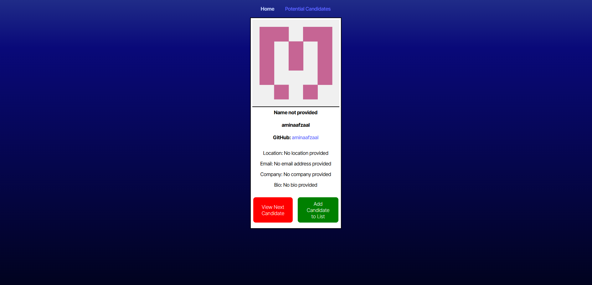
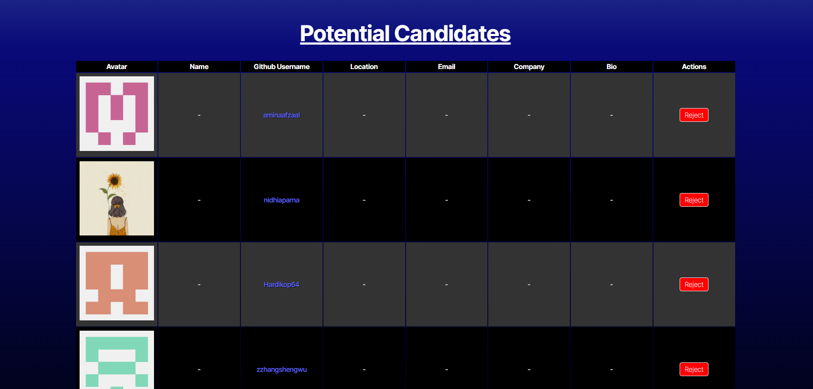

# candidateSearch 
            
## Description

This application provides the user with a list of random Github profiles and some information about that user. The user can either skip to the next profile, or add the profile to a list of potential candidates for viewing, possible collaboration or possible employment.

 

            
## Table of Contents
- [Installation](#installation)
- [Usage](#usage)
- [Credits](#credits)
- [Testing](#testing)
- [Questions](#questions)
- [License](#license)
            
## Installation

No installation is required, this project is a webpage hosted on Render and can be accessed <a href="https://candidatesearch-bwkn.onrender.com">here</a>.

            
## Usage

This applicaiton can be used to obtain a list of Github profiles to potentially contact for collaboration or to discuss employment opportunities.

            
## Credits

### Author

Devyn Johnson | <a href="https://github.com/DevynJohnson">Github Profile</a>

        
### Collaborators and Contribution Instructions

If you would like to contribute to this project, please <a href="mailto:dljohnson1313@gmail.com">email me</a>.

            
### Third-Party Assets

react-bootstrap | <a href="https://www.npmjs.com/package/react-bootstrap">https://www.npmjs.com/package/react-bootstrap</a>

React | <a href="https://react.dev/">https://react.dev/</a>

Render | <a href="https://render.com/">https://render.com/</a>

Vite | <a href="https://vite.dev/">https://vite.dev/</a>

react-router-dom | <a href="https://www.npmjs.com/package/react-router-dom">https://www.npmjs.com/package/react-router-dom</a>

This project contains code provided by edX. | <a href="https://www.edx.org/">https://www.edx.org/</a>

## Testing

If there are any issues, please reach out to dljohnson1313@gmail.com or open an issue on the Github repository. Please provide any console errors or other relevant information about the problem being experienced.

## Questions

For questions, see my profile at <a href="https://github.com/DevynJohnson">Github</a> or <a href="mailto:dljohnson1313@gmail.com">email me</a>.

            
## License
<a href="https://opensource.org/licenses/MIT">MIT License</a>

Copyright (c) 2025 Alexander Shegstad

Permission is hereby granted, free of charge, to any person obtaining a copy of this software and associated documentation files (the "Software"), to deal in the Software without restriction, including without limitation the rights to use, copy, modify, merge, publish, distribute, sublicense, and/or sell copies of the Software, and to permit persons to whom the Software is furnished to do so, subject to the following conditions:

The above copyright notice and this permission notice shall be included in all copies or substantial portions of the Software.

THE SOFTWARE IS PROVIDED "AS IS", WITHOUT WARRANTY OF ANY KIND, EXPRESS OR IMPLIED, INCLUDING BUT NOT LIMITED TO THE WARRANTIES OF MERCHANTABILITY, FITNESS FOR A PARTICULAR PURPOSE AND NONINFRINGEMENT. IN NO EVENT SHALL THE AUTHORS OR COPYRIGHT HOLDERS BE LIABLE FOR ANY CLAIM, DAMAGES OR OTHER LIABILITY, WHETHER IN AN ACTION OF CONTRACT, TORT OR OTHERWISE, ARISING FROM, OUT OF OR IN CONNECTION WITH THE SOFTWARE OR THE USE OR OTHER DEALINGS IN THE SOFTWARE.
